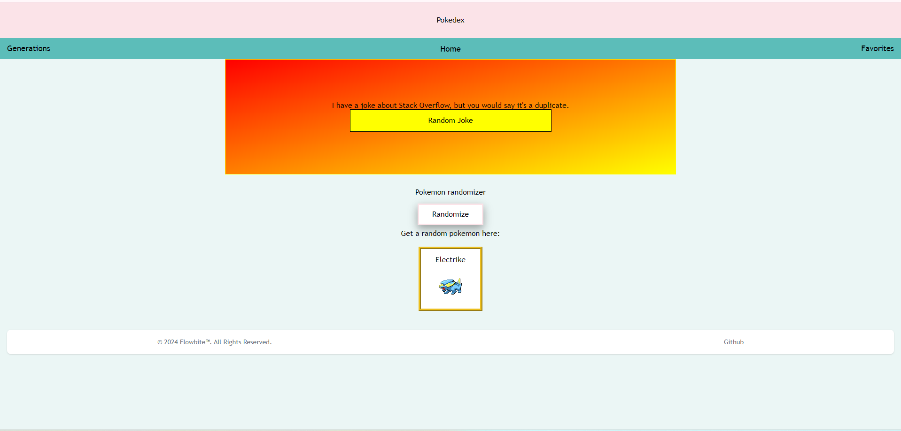
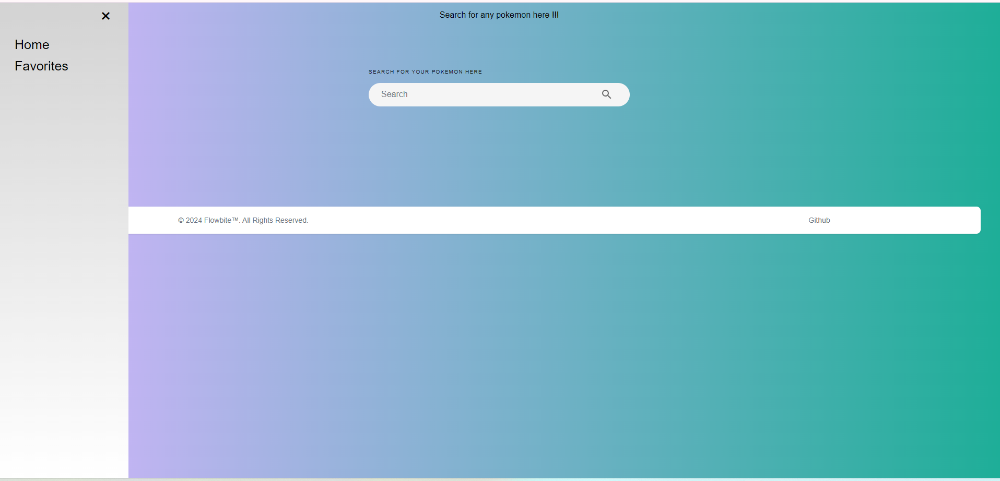
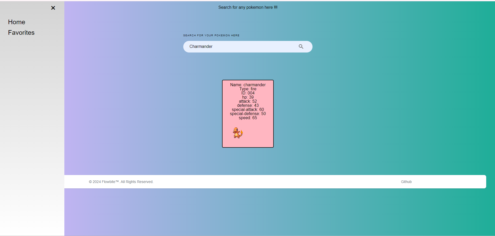
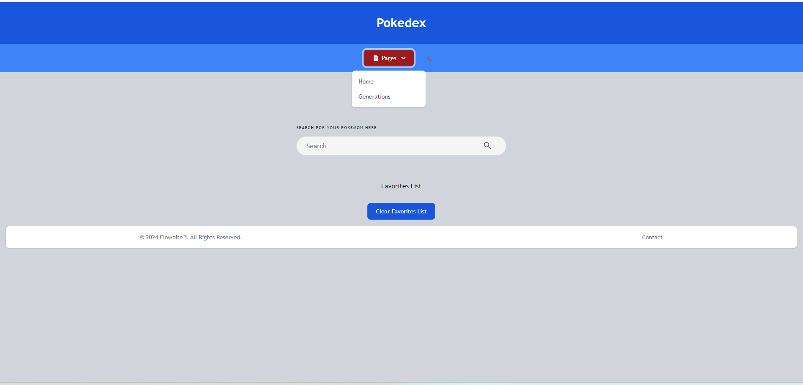
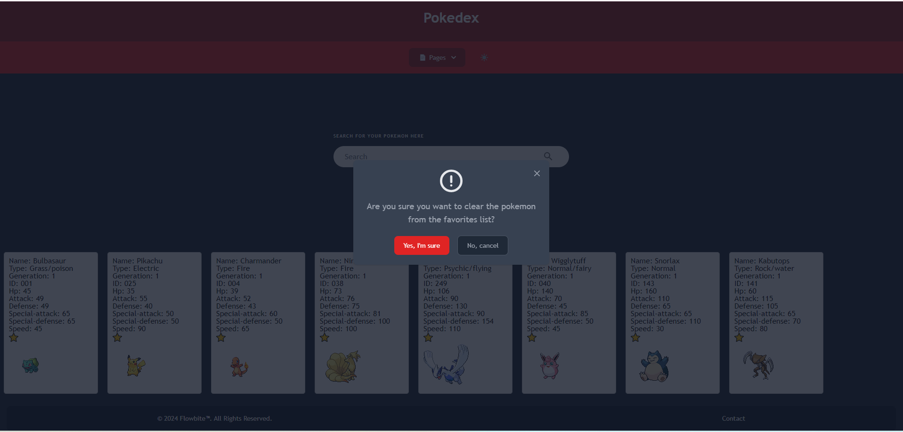

# PokeDex
Searching for pokemon hasn't ever been easier with our PokeDex.

## Description
Our Pokedex is a consolidated website that contains several different generations of Pokemon. On our home page, you can get a random pokemon, and a random joke as well. In our generations page, you can search in our polished search base for any Pokemon that your heart desires. Hop on over to our favorites page, and you can search for and save various Pokemon for easier access later on.

## Badges
Shields.io

## Visuals
Link: <a href="https://DallasGiles.github.io/pokedex/" alt="live site link">Live Link</a>

Home page screenshots:

Generations page screenshots:

Favorites page screenshots:

## Installation
N/A

## Usage
Searching for a pokemon: #

Randomly generating a pokemon: #

Adding pokemon to your favorites list: You can add your pokemon to the favorites list using the API found on https://pokeapi.co/docs/v2. You can also remove favorited pokemon either by clicking the favorite toggle button on the pokemon card or by clicking on the clear list button and removing all of the favorited pokemons at once.

Randomly generating programming jokes: #

## Support
People who supported this project were DallasGiles, bwater47, Cherbear01, and OliviaRod. You can contact us through our github profiles.
Link: <a href="https://github.com/DallasGiles" alt="GitHub Link">GitHub profile link</a>
Link: <a href="https://github.com/bwater47" alt="GitHub Link">GitHub profile link</a>
Link: <a href="https://github.com/Cherbear01" alt="GitHub Link">GitHub profile link</a>
Link: <a href="https://github.com/OliviaRod" alt="GitHub Link">GitHub profile link</a>

## Roadmap
N/A

## Contributing
Contributing is allowed if you're in the U of U Coding Bootcamp. Contact us on the slack channel for information.

## Authors and acknowledgment
Bootcamp Spot. (04/11/2024). https://bootcampspot.com/

W3Schools Online Web Tutorials. (04/11/2024). https://www.w3schools.com/ 

Chatgpt. ChatGPT. (04/11/2024). https://openai.com/chatgpt

Themesberg. (n.d.-a). Flowbite - tailwind CSS Component Library. flowbite.com. https://flowbite.com/docs/getting-started/introduction/ 

• Please note: While ChatGPT was utilized to generate dialog content for the README file, it was not involved in the generation of any code, HTML edits, CSS edits, or other assets within the repository apart from this README specifically.

• All other sources, links, and information utilized within the project were obtained from the provided sources mentioned in this paragraph. This includes class materials, modules, TA guidance, instructor-provided resources, as well as communication through platforms such as Slack or Discord. Additionally, numerous links and resources were provided within the assignment instructions and demonstrated during class sessions.

## Project status
N/A