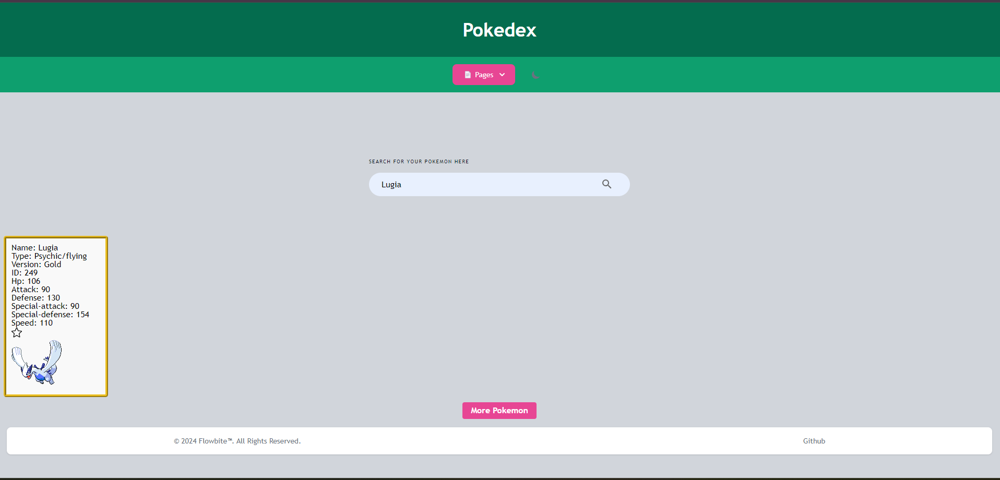
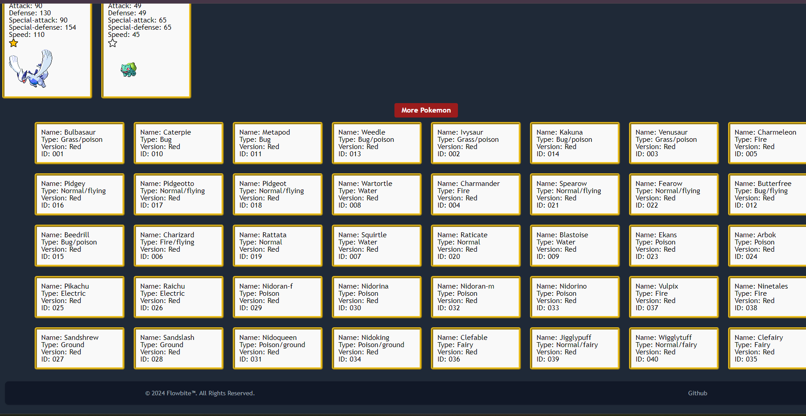
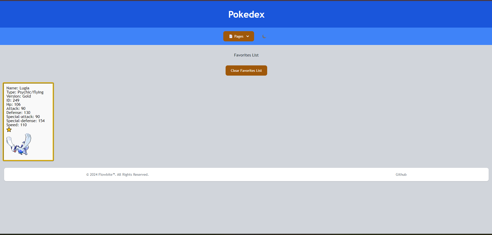

# PokeDex
Searching for pokemon hasn't ever been easier with our PokeDex.

## Description
Our Pokedex contains several different generations of Pokemon. On our home page, you can get a random pokemon, and a random joke as well. In our search page, you can search in our polished search base for any Pokemon that your heart desires. Hop on over to our favorites page, and you can interact with the favorited pokemon, and either keep them there, clear the whole list, or remove them one at time by unfavoriting.

## Badges
Shields.io

## Visuals
Link: <a href="https://DallasGiles.github.io/pokedex/" alt="live site link">Live Link</a>

Home page screenshots:

Generations page screenshots:

Favorites page screenshots:

## Installation
Download visual studio code, and git bash. Then use git bash to clone over the repo (tutorial not provided). Then download the extension "Live-Servers" for vs code. When thats done open visual studio code after going into the directory for the website by using the "cd /examplepath" command in the CLI of git bash. After those are downloaded keep git bash open, and use "code ." in the "Command-Line-Interface". Then once you're in vs code right click the index.html file located in the file explorer tab (on windows use CTRL-Shift-E) on the side-nav bar. Once you've right clicked it you'll see open with live-server then click on that.

## Usage
Searching for a pokemon: This can be done on the search page, and you can also see more pokemon by clicking the "More Pokemon" button if you dont know what to search for.

Randomly generating a pokemon: This can be done on the home page, and you can click the "Randomize" button to see a randomly generated pokemon sprite with its name. 

Adding pokemon to your favorites list: You can add your pokemon to the favorites list using the API found on https://pokeapi.co/docs/v2. You can also remove favorited pokemon either by clicking the favorite toggle button on the pokemon card or by clicking on the clear list button to remove all of the favorited pokemons at once.

Randomly generating programming jokes: This can be done on the home page by clicking the Random Joke button which gives you a random programming joke.

## Support
People who supported this project were DallasGiles Link: <a href="https://github.com/DallasGiles" alt="GitHub Link">GitHub profile link</a>, bwater47 Link: <a href="https://github.com/bwater47" alt="GitHub Link">GitHub profile link</a>, Cherbear01 Link: <a href="https://github.com/Cherbear01" alt="GitHub Link">GitHub profile link</a>, and OliviaRod Link: <a href="https://github.com/OliviaRod" alt="GitHub Link">GitHub profile link</a>. You can contact us through our github profiles.

## Roadmap
Finished.

## Contributing
Contributing is allowed if you're in the U of U Coding Bootcamp. Contact us on the slack channel for information.

## Authors and acknowledgment
Bootcamp Spot. (04/18/2024). https://bootcampspot.com/

W3Schools Online Web Tutorials. (04/18/2024). https://www.w3schools.com/ 

Chatgpt. ChatGPT. (04/18/2024). https://openai.com/chatgpt

Themesberg. (n.d.-a). Flowbite - tailwind CSS Component Library. flowbite.com. (04/18/2024) https://flowbite.com/docs/getting-started/introduction/ 

• Please note: While ChatGPT was utilized to generate dialog content for the README file, it was not involved in the generation of any code, HTML edits, CSS edits, or other assets within the repository apart from this README specifically.

• All other sources, links, and information utilized within the project were obtained from the provided sources mentioned in this paragraph. This includes class materials, modules, TA guidance, instructor-provided resources, as well as communication through platforms such as Slack or Discord. Additionally, numerous links and resources were provided within the assignment instructions and demonstrated during class sessions.

## Project status
Closed.